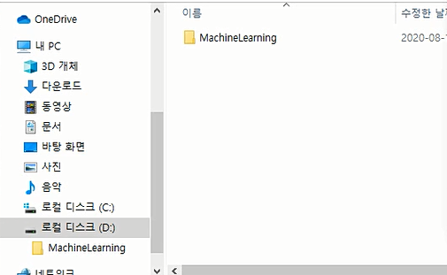

# 2.Jupyter notebook

## \* Jupyter Notebook 인스톨   

* 개발 IDE는 jupyter notebook을 사용해보자
  1. jupyter notebook 가상공간에 인스톨
  2. 가상공간 폴더에서 conda install nb\_conda 또는  conda install notebook\_conda
  3. nb\_conda==&gt; notebook\_conda

## working directory 생성   

* jupyter notebook 의 working directory를 설정한 후사용하자
  1. 기본적으로 notebook을 시행하면 가상공간의 root가 작업영역이 되므로 작업공간을 만들기 위해 노트북 환경설정 파일의 위치 파악후 수정
  2. 위치 파악 : \(data\_env\) C:\Windows\system32&gt; jupyter notebook --generate-config
  3. 생성된 설정파일 수정 :  Writing default config to: C:\Users\user.jupyter\jupyter\_notebook\_config.py  이렇게 출력되면 위치에 가서 config.py를 메모장\( 에디터\)로 연다
  4.  notebook\_dir로 찾아서 작업공간 이름 명시
     1. \#\# The directory to use for notebooks and kernels.
     2. \#c.NotebookApp.notebook\_dir =  'd:/MachineLearning'
  5. 설정이 거의 완료되었으니 jupyter notebook 실행
     1. jupyter notebook 실행  \(data\_env\) C:\Windows\system32&gt; jupyter notebook
     2. 크롬환경 
     3. new에서  작업환경 설정된것 선택해야 된다

## Jupyter notebook 실행    

## Jupyter Lab 

쥬피터 노트북의  확장버전이라 하겠다. 프로젝트 개발시 사용하기 편한 IDE 

